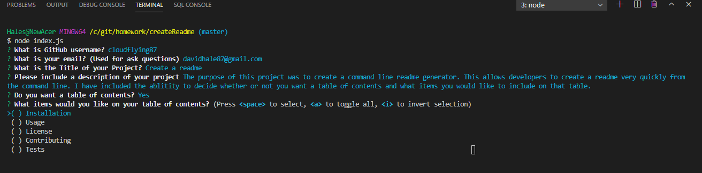
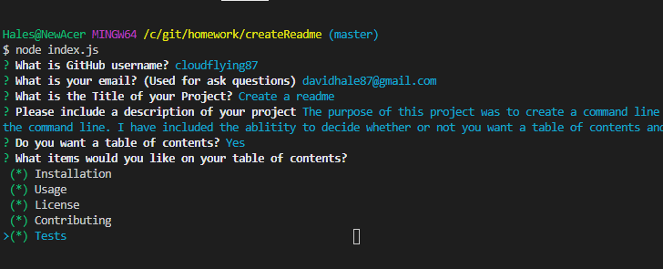
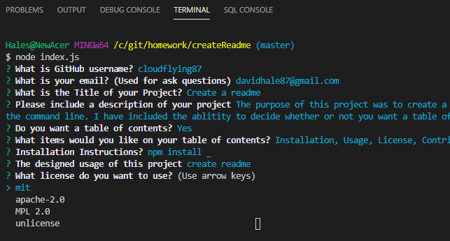
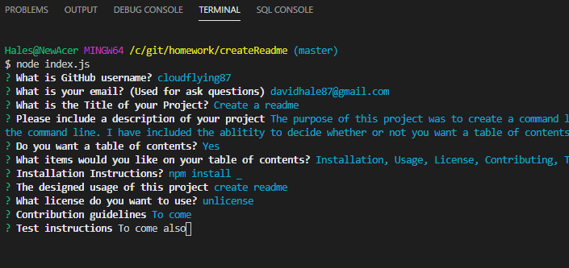
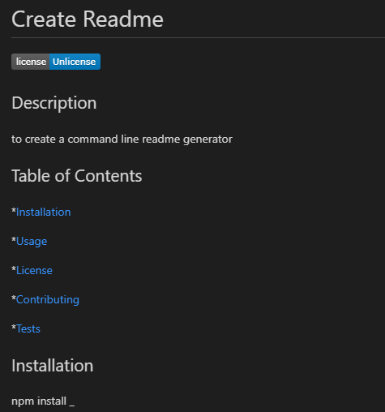

# Generate Readme

## Description
The purpose of this project was to create a command line readme generator. This allows developers to create a readme very quickly from the command line. I have included the ablitity to decide whether or not you want a table of contents and what items you would like to include on that table. 

## Usage
This program is built on inquirer. For it to run correctly you will need to install inquirer. The program also uses the built in methods fs and util. 

## Instructions
To run this program you will just run it from index.js

## Screenshots

The table of contents expanded. You will use the space bar to select the option. 

A closer view of the expanded table with everything selected.

Here are the license options

